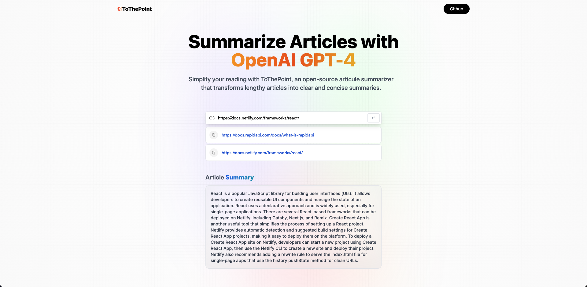

# ToThePoint

[](https://app.netlify.com/sites/tothepoint-ai/deploys)


ToThePoint is an open source code for an AI-powered article summarizer web application. The application leverages OpenAI's language model to generate concise summaries from lengthy articles, providing a user-friendly interface for easy and efficient information consumption.

### Overview

The AI Article Summarizer is designed to take the URL of an article as input and return a summarized version of the article. This tool is particularly useful for quickly understanding the main points of long articles without having to read through the entire text.

### Key Features

1. **Modern User Interface**: Clean and intuitive design built with React.js and Tailwind CSS.
2. **Summary Generation**: Automatically generates concise summaries for any article provided.
3. **History Saving**: Saves summary history locally for easy access and management.
4. **Copy to Clipboard**: Allows users to easily copy summaries to the clipboard.
5. **Advanced API Requests**: Utilizes Redux Toolkit Query for optimized API interactions.

### Tech Stack

- **React.js**: JavaScript library for building user interfaces.
- **TypeScript**: Typed superset of JavaScript that compiles to plain JavaScript.
- **Redux Toolkit**: State management tool.
- **Tailwind CSS**: Utility-first CSS framework.

## Getting Started

Follow these steps to set up the project locally:

### Prerequisites

- Git
- Node.js
- npm (Node Package Manager)

### Installation

1. Clone the repository:

   ```bash
   git clone https://github.com/alejxung/ToThePoint.git
   cd ToThePoint
   ```

2. Install dependencies:

   ```bash
   npm install
   ```

3. Set up environment variables:
   Create a `.env` file in the root directory with the following content:

   ```plaintext
   VITE_RAPID_API_ARTICLE_KEY=
   ```

   Replace the placeholder with your actual API key from Rapid API.

4. Run the project:

   ```bash
   npm run dev
   ```

   Open [http://localhost:5173](http://localhost:5173) in your browser to view the application.
